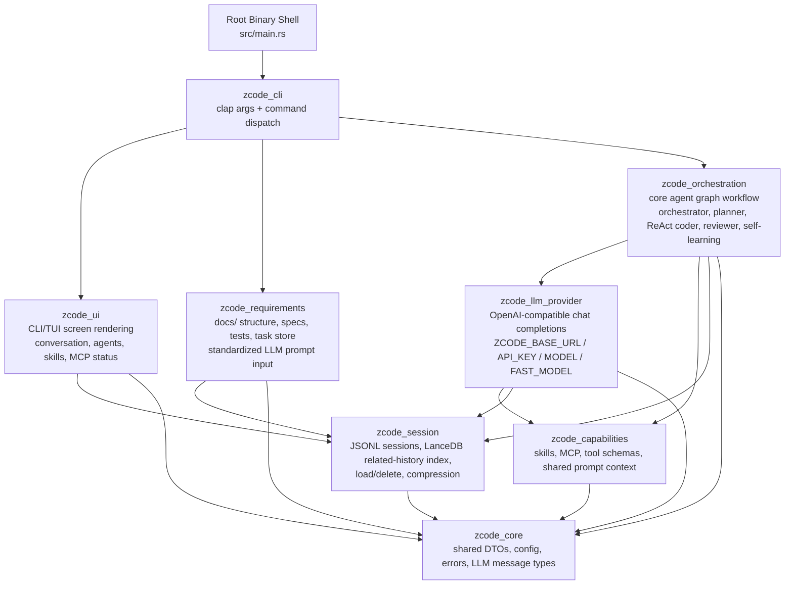
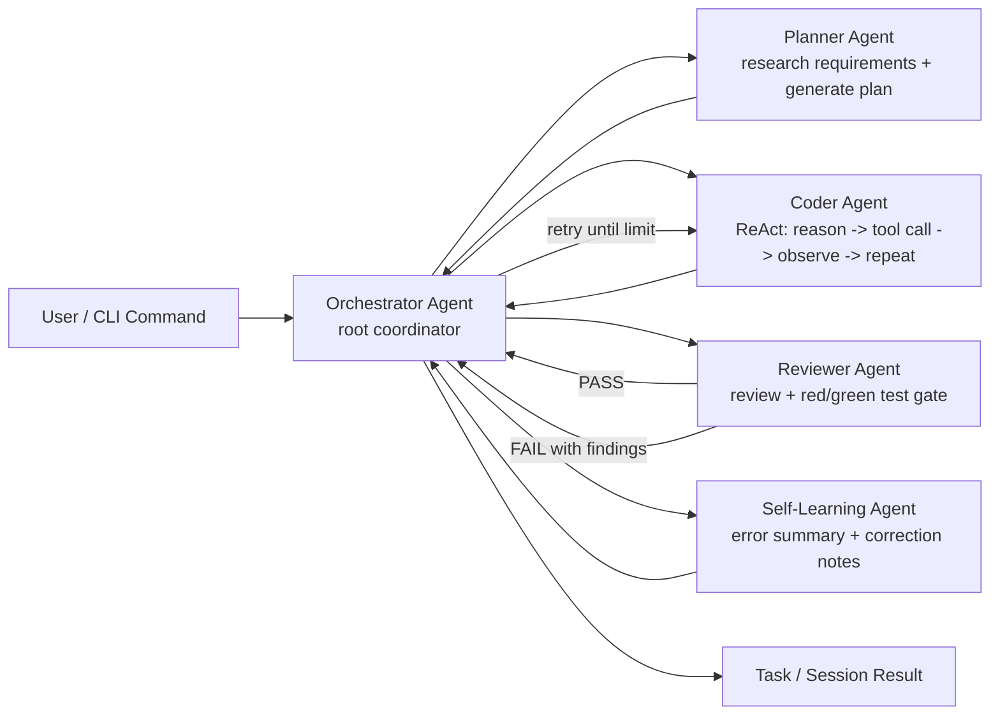
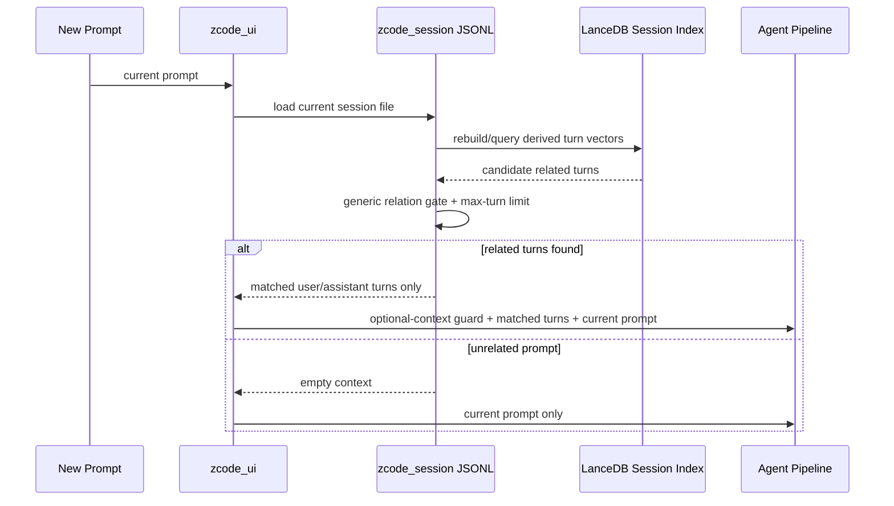
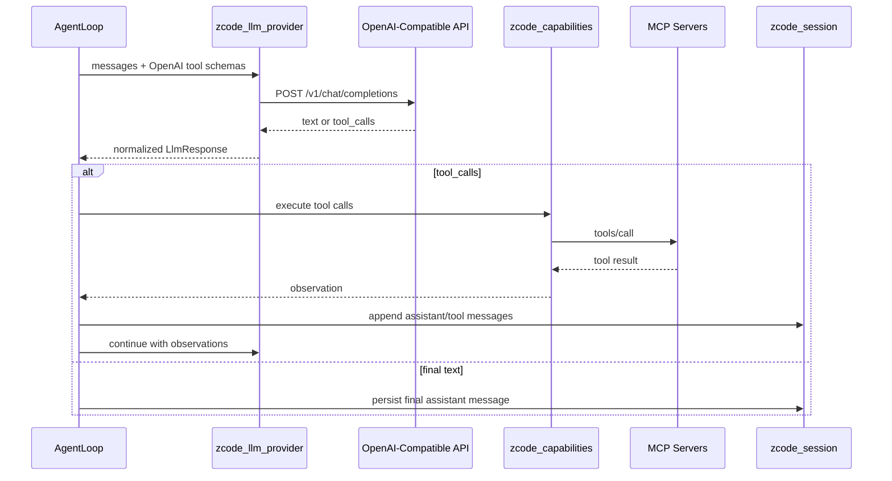

# zcode Architecture

`zcode` is a layered Rust workspace for an AI coding agent CLI. The root package keeps the binary/export shell; CLI behavior and core behavior live in focused crates.

中文说明见 [docs/architecture.zh-CN.md](docs/architecture.zh-CN.md)。

## Architecture Diagrams

### Workspace Layering



### Agent Workflow



Sub agents are coordinated by the root orchestrator. Planner, coder, reviewer, and self-learning agents do not talk directly to each other in the conceptual workflow; the orchestration graph carries state and routing decisions.

### Fresh Context Selection



Session JSONL is the durable source of truth. LanceDB is a local,
rebuildable index derived from that log, so deleting or regenerating the index
does not lose conversation history.

### LLM Tool Loop



## Workspace Layers

```text
src/main.rs
  Minimal binary shell: parse args, initialize tracing, call zcode_cli.
        |
        v
crates/zcode_cli
  Owns clap argument definitions and command dispatch. It wires user
  commands into requirements, capabilities, orchestration, LLM provider,
  and UI layers.
        |
        v
crates/zcode_ui
  Renders the CLI/TUI screen for the current session: conversation,
  active agents, skills, MCP servers, and status.
        |
        v
crates/zcode_requirements
  Owns docs/ scaffolding, validation, task parsing, and task storage.
  This layer standardizes requirement/test documents before they become
  LLM prompt input.
        |
        v
crates/zcode_orchestration
  Defines the agent graph workflow. The root orchestrator coordinates
  planner, ReAct coder, reviewer, and self-learning behavior. Child
  agents communicate through the root/orchestration graph rather than
  directly with each other.
        |
        v
crates/zcode_llm_provider
  OpenAI-compatible chat completions implementation. Uses:
  ZCODE_BASE_URL, ZCODE_API_KEY, ZCODE_MODEL, ZCODE_FAST_MODEL.
        |
        v
crates/zcode_capabilities
  Skills, MCP client/adapters, global shared prompt/context, and
  OpenAI-compatible tool-call schema/execution helpers.
        |
        v
crates/zcode_session
  JSONL session message storage, list/load/delete, LanceDB-backed
  related-history retrieval, and deterministic message compression that
  preserves summary plus recent/key messages.
        |
        v
crates/zcode_core
  Shared config, error types, LLM DTOs, and agent/session DTOs.
```

## Runtime Flow

```text
1. The root binary parses a command through zcode_cli.
2. zcode_requirements validates or generates docs/ as needed.
3. zcode_capabilities loads skills and connects configured MCP servers.
4. zcode_orchestration builds an agent graph:
   orchestrator -> planner -> coder(ReAct) -> reviewer/test gate;
   failures loop reviewer -> orchestrator -> coder until retry limits.
5. zcode_llm_provider sends OpenAI-compatible chat completion requests.
6. Tool calls are returned in OpenAI function-call format.
7. AgentLoop executes tool calls through ToolRegistry and appends tool
   messages back into the conversation.
8. zcode_session stores session messages in one JSONL file per session and
   selects only related prior turns for the next prompt.
9. zcode_ui displays conversation and agent/capability status.
```

## Startup Path

Interactive chat is designed to show the first TUI frame before any session
retrieval or LLM work. The synchronous startup path in `execute_chat` is:

1. Load user settings.
2. Initialize the terminal.
3. Load project config.
4. Build agent provider handles.
5. Load skill metadata from project and configured global directories.
6. Build the tool registry.
7. Create the TUI app and enter the render loop.

LanceDB is not on the first-frame path. It is used after the user submits a
prompt, when `zcode_session` selects related prior turns for that prompt.

The expensive startup boundary is MCP auto-start. Each configured auto-start
MCP server is launched synchronously and must complete `initialize` plus
`tools/list` before its tools are registered. Slow MCP servers should be marked
`auto_start = false`, attached explicitly with `-M` when needed, or moved to a
lazy/background connection model.

When measuring startup, run the compiled binary directly. `cargo run -- chat`
includes Cargo graph checks, incremental compilation, linking, and process
launch overhead; it is not a clean measure of zcode runtime startup latency.

## Agent Graph

The orchestration layer keeps the workflow explicit:

| Agent | Responsibility |
|-------|----------------|
| Orchestrator | Root coordinator. Assigns work and handles retry decisions. |
| Planner | Reads standardized requirement docs/context and produces an executable plan. |
| Coder | Uses ReAct: reason, call available MCP/capability tools, observe results, repeat, report. Simple tasks can use the fast model. |
| Reviewer | Performs review and red/green test verification. Failures are reported back to orchestration for coder retries. |
| Self-learning | Summarizes recurring errors and corrections into learning entries. |

The runtime currently models these responsibilities with `StateGraph` nodes and shared `DefaultState`. The CLI constructs task and reviewer pipelines from `crates/zcode_orchestration/src/agent/graph/pipeline.rs`.

## LLM Provider

All LLM requests use an OpenAI-compatible chat completions endpoint.

| Variable | Purpose |
|----------|---------|
| `ZCODE_BASE_URL` | Service root, `/v1` root, or full `/chat/completions` URL |
| `ZCODE_API_KEY` | Bearer token for the provider |
| `ZCODE_MODEL` | Default model |
| `ZCODE_FAST_MODEL` | Optional fast model for simple tasks |

`RigProvider` converts internal `Message` values into OpenAI chat messages, sends the request with `reqwest`, and parses text/tool-call responses.

## Capabilities And Tools

`zcode_capabilities` owns the runtime tool boundary.

- MCP tools are discovered through `tools/list` and executed through `tools/call`.
- `ToolRegistry` exposes OpenAI-compatible function schemas to LLM calls.
- Built-in local file, shell, search, glob, and AST tools are intentionally not registered by default.
- Skills are loaded from `docs/skills/*/SKILL.md` plus configured extra skill
  directories, then selected per prompt by generic relevance scoring over
  `name`, `description`, optional `triggers`, and body text. Only selected
  skills are rendered into the agent system prompt.

## Session Management

`zcode_session` stores each interactive chat session as one JSONL file under
`.zcode/sessions/`. It also keeps a derived LanceDB index under
`.zcode/session-index/` for related-turn lookup. It supports:

- creating and saving sessions as append-friendly session logs
- listing and loading history
- deleting specific sessions
- selecting related prior turns with a LanceDB-backed local intent-vector index
  before each new prompt
- compressing older messages into a deterministic summary while retaining recent messages

The context-selection path is fresh by default: each new prompt is matched
against prior turns using generic local intent indexing, and unrelated prompts
receive no prior conversation. Related prompts receive only the matched turns.
Both compression and local intent vector generation are intentionally LLM-free
so they can run reliably without network access; LanceDB owns vector storage and
nearest-neighbor candidate retrieval. The current vectorizer is deterministic
and generic, not domain-specific, so prompts about weather, files, code, or any
other topic are treated by the same retrieval path. Provider embeddings can
replace the vectorizer later without changing JSONL storage or the UI/agent
call sites.

### Session Design Advantages

| Design choice | Advantage |
|---|---|
| One JSONL file per session | Keeps the conversation easy to inspect, append, copy, and recover. It also prevents the old failure mode where every prompt produced separate task/session files. |
| JSONL as source of truth | The vector index is disposable. If LanceDB files are missing or stale, they can be rebuilt from the session log without losing user-visible history. |
| LanceDB as derived index | Uses a real vector database boundary for nearest-neighbor retrieval while keeping persistence ownership in `zcode_session`. This gives a clear path to larger indexes and provider embeddings. |
| Fresh-by-default context | A new unrelated question starts clean, so answers do not accidentally continue prior tasks or repeat old file listings. |
| Matched-turn injection only | The LLM receives only relevant user/assistant turns, not the entire chat transcript. This reduces prompt noise, token use, and cross-topic contamination. |
| Optional-context guard | Related history is explicitly framed as optional background, so the current prompt remains the source of truth. |
| Generic relation gate | The final related/unrelated decision uses generic token/profile overlap plus vector similarity, not hardcoded topic names. |
| LLM-free retrieval path | Session context selection works offline and is deterministic in tests; LLM calls are reserved for actual agent reasoning. |
| Layer-local ownership | `zcode_ui` asks for related history, `zcode_session` owns storage/retrieval, and orchestration receives already-scoped context. That keeps the agent graph independent from storage details. |

## Root Shell

| Module | Current Role |
|--------|--------------|
| `src/main.rs` | CLI process entry point |
| `src/lib.rs` | Public re-export shell over the `zcode_*` workspace crates |
| `crates/zcode_cli` | CLI argument parsing and command dispatch |

The old `src/cli`, `src/ast`, `src/git`, `src/lsp`, `src/memory`, `src/script`, and `src/workspace` compatibility modules were removed. New behavior should go into the owning `crates/zcode_*` layer rather than recreating old root-package modules.

## Dependency Direction

Dependencies flow downward:

```text
ui / cli
  -> requirements
  -> orchestration
  -> llm_provider
  -> capabilities
  -> session
  -> core
```

`zcode_core` should not depend on higher layers. Higher layers share DTOs through `zcode_core` to avoid dependency cycles.
