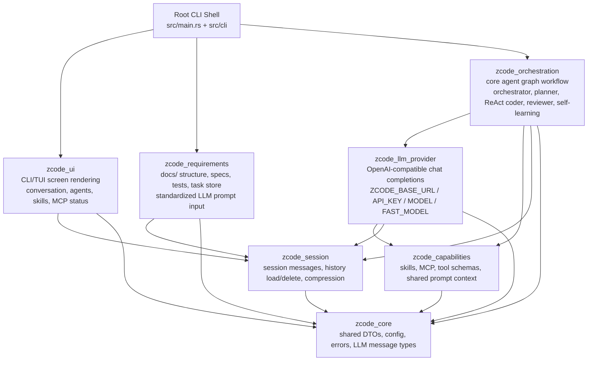
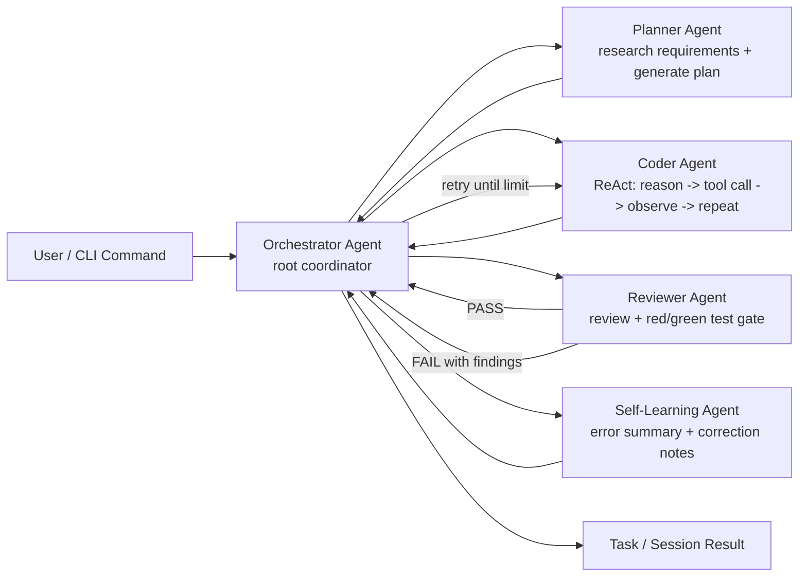
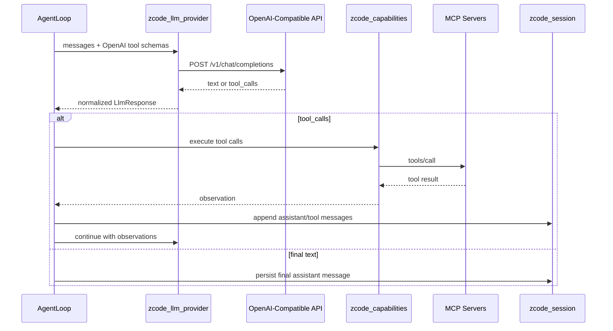

# zcode Architecture

`zcode` is a layered Rust workspace for an AI coding agent CLI. The root package keeps the CLI shell and compatibility exports; core behavior lives in focused crates.

## Architecture Diagrams

### Workspace Layering



### Agent Workflow



Sub agents are coordinated by the root orchestrator. Planner, coder, reviewer, and self-learning agents do not talk directly to each other in the conceptual workflow; the orchestration graph carries state and routing decisions.

### LLM Tool Loop



## Workspace Layers

```text
src/main.rs + src/cli
        |
        v
crates/zcode_ui
  Renders the CLI/TUI screen for the current session: conversation,
  active agents, skills, MCP servers, and status.
        |
        v
crates/zcode_requirements
  Owns docs/ scaffolding, validation, task parsing, and task storage.
  This layer standardizes requirement/test documents before they become
  LLM prompt input.
        |
        v
crates/zcode_orchestration
  Defines the agent graph workflow. The root orchestrator coordinates
  planner, ReAct coder, reviewer, and self-learning behavior. Child
  agents communicate through the root/orchestration graph rather than
  directly with each other.
        |
        v
crates/zcode_llm_provider
  OpenAI-compatible chat completions implementation. Uses:
  ZCODE_BASE_URL, ZCODE_API_KEY, ZCODE_MODEL, ZCODE_FAST_MODEL.
        |
        v
crates/zcode_capabilities
  Skills, MCP client/adapters, global shared prompt/context, and
  OpenAI-compatible tool-call schema/execution helpers.
        |
        v
crates/zcode_session
  Session message storage, list/load/delete, and deterministic message
  compression that preserves summary plus recent/key messages.
        |
        v
crates/zcode_core
  Shared config, error types, LLM DTOs, and agent/session DTOs.
```

## Runtime Flow

```text
1. CLI parses a command in src/cli.
2. zcode_requirements validates or generates docs/ as needed.
3. zcode_capabilities loads skills and connects configured MCP servers.
4. zcode_orchestration builds an agent graph:
   orchestrator -> planner -> coder(ReAct) -> reviewer/test gate;
   failures loop reviewer -> orchestrator -> coder until retry limits.
5. zcode_llm_provider sends OpenAI-compatible chat completion requests.
6. Tool calls are returned in OpenAI function-call format.
7. AgentLoop executes tool calls through ToolRegistry and appends tool
   messages back into the conversation.
8. zcode_session stores and compresses session messages for history reuse.
9. zcode_ui displays conversation and agent/capability status.
```

## Agent Graph

The orchestration layer keeps the workflow explicit:

| Agent | Responsibility |
|-------|----------------|
| Orchestrator | Root coordinator. Assigns work and handles retry decisions. |
| Planner | Reads standardized requirement docs/context and produces an executable plan. |
| Coder | Uses ReAct: reason, call available MCP/capability tools, observe results, repeat, report. Simple tasks can use the fast model. |
| Reviewer | Performs review and red/green test verification. Failures are reported back to orchestration for coder retries. |
| Self-learning | Summarizes recurring errors and corrections into learning entries. |

The runtime currently models these responsibilities with `StateGraph` nodes and shared `DefaultState`. The CLI constructs task and reviewer pipelines from `crates/zcode_orchestration/src/agent/graph/pipeline.rs`.

## LLM Provider

All LLM requests use an OpenAI-compatible chat completions endpoint.

| Variable | Purpose |
|----------|---------|
| `ZCODE_BASE_URL` | Service root, `/v1` root, or full `/chat/completions` URL |
| `ZCODE_API_KEY` | Bearer token for the provider |
| `ZCODE_MODEL` | Default model |
| `ZCODE_FAST_MODEL` | Optional fast model for simple tasks |

`RigProvider` converts internal `Message` values into OpenAI chat messages, sends the request with `reqwest`, and parses text/tool-call responses.

## Capabilities And Tools

`zcode_capabilities` owns the runtime tool boundary.

- MCP tools are discovered through `tools/list` and executed through `tools/call`.
- `ToolRegistry` exposes OpenAI-compatible function schemas to LLM calls.
- Built-in local file, shell, search, glob, and AST tools are intentionally not registered by default.
- Skills and global shared context are rendered into system prompts for LLM providers and agents.

## Session Management

`zcode_session` stores session messages under `.zcode/sessions/` and supports:

- creating and saving sessions
- listing and loading history
- deleting specific sessions
- compressing older messages into a deterministic summary while retaining recent messages

The compression path is intentionally LLM-free so it can run reliably without network access; callers can replace or augment the summary with an LLM summary later.

## Compatibility Modules

Some older modules remain under `src/`:

| Module | Current Role |
|--------|--------------|
| `src/cli` | Binary command parsing and orchestration wiring |
| `src/workspace` | Compatibility facade for config, snapshots, and context helpers |
| `src/ast`, `src/git`, `src/lsp`, `src/memory`, `src/script` | Retained subsystems used by tests or compatibility exports |

New core behavior should go into the owning `crates/zcode_*` layer rather than recreating removed old modules.

## Dependency Direction

Dependencies flow downward:

```text
ui / cli
  -> requirements
  -> orchestration
  -> llm_provider
  -> capabilities
  -> session
  -> core
```

`zcode_core` should not depend on higher layers. Higher layers share DTOs through `zcode_core` to avoid dependency cycles.
