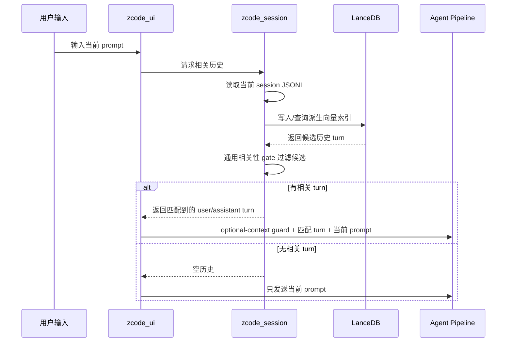

# zcode 中文架构说明

本文档说明 zcode 当前的分层架构、会话上下文设计，以及这套设计为什么能减少上下文污染。

## 总体结构

zcode 是一个 Rust Cargo workspace。根包只保留二进制入口和导出壳，具体能力由各个 `crates/zcode_*` crate 按职责承载。

| 层 | 职责 |
|---|---|
| `zcode_cli` | 命令行参数、命令分发、把配置和 runtime 组装起来 |
| `zcode_ui` | TUI 渲染、输入队列、agent 状态、会话展示 |
| `zcode_requirements` | `docs/` 需求文档、任务记录、校验和解析 |
| `zcode_orchestration` | agent graph、supervisor/planner/coder/reviewer/self-learning 工作流 |
| `zcode_llm_provider` | OpenAI-compatible chat completions 请求和流式响应解析 |
| `zcode_capabilities` | MCP、skills、tool schema、tool 执行边界 |
| `zcode_session` | JSONL 会话存储、LanceDB 相关历史检索、压缩 |
| `zcode_core` | 共享配置、错误类型、LLM DTO、agent/session DTO |

核心依赖方向是从 UI/CLI 往下依赖到 core。`zcode_core` 不反向依赖任何上层模块，从而避免循环依赖。

## 启动路径和性能边界

评估 zcode 启动速度时，应直接运行已经编译好的二进制：

```bash
cargo build --workspace
target/debug/zcode --skip-docs-check chat
```

`cargo run -- chat` 适合开发调试，但它的耗时包含 Cargo 的依赖图检查、增量编译、链接和进程启动开销。这个时间不等同于 zcode 自身的 TUI 启动耗时。

`chat` 首屏路径刻意保持轻量。进入 TUI render loop 之前，同步执行的事情只有：

1. 读取用户 settings。
2. 初始化 terminal。
3. 读取 project config。
4. 构建 agent provider 句柄。
5. 从项目和全局目录加载 skill metadata。
6. 构建 tool registry。
7. 创建 TUI app 并进入渲染循环。

LanceDB 不在首屏关键路径上。它只会在用户提交 prompt 后，用于从当前 session 的 JSONL 历史中检索相关 turn。

真正可能拖慢首屏的是 MCP auto-start。每个自动启动的 MCP server 都会同步启动子进程，并完成 `initialize` 和 `tools/list` 后才注册工具。慢 MCP 应该配置为 `auto_start = false`，需要时通过 `-M` 显式附加，或者后续改成 lazy/background 连接。

## 会话上下文架构

### 目标

同一个 chat session 中，用户经常会混合不同类型的问题。例如先问项目目录，再问天气；或者先让 agent 修改代码，再临时问一个无关知识点。旧做法如果把整段历史都塞回 LLM，会导致模型把不相关历史当成当前任务上下文，出现“问天气却继续说代码组件”的问题。

新的会话上下文策略是 fresh by default：

- 当前 prompt 永远是唯一必须回答的请求。
- 历史消息默认不进入 LLM。
- 只有当前 prompt 和历史 turn 被判定相关时，才注入匹配到的历史 turn。
- 注入的历史会被标记为 optional background，不能覆盖当前 prompt。

### 存储布局

```text
.zcode/
  sessions/
    session-*.jsonl       # 每个 chat session 一个 JSONL 文件
  session-index/
    session-*             # 从 JSONL 派生出来的 LanceDB 本地索引
  tasks/
    *.json                # zcode task 命令的任务记录，不是 chat prompt 存储
```

JSONL 是会话的 source of truth。LanceDB 索引只是从 JSONL 派生的检索加速结构，可以删除后重建，不会丢失用户可见历史。

### 新 prompt 的处理流程



## LanceDB 的角色

LanceDB 在这里承担本地向量数据库角色：

- 存储当前 session 历史 turn 的向量。
- 根据当前 prompt 的向量做 nearest-neighbor 候选召回。
- 返回候选后，由 `zcode_session` 再做通用 relation gate。

当前向量生成是 deterministic local intent vectorizer，不依赖 LLM，不需要网络，也没有天气、城市、项目名等领域硬编码。后续如果要切换成 provider embeddings，只需要替换 vectorizer/embedding adapter，JSONL 存储、TUI 调用点和 agent pipeline 都不需要重写。

## Skill 选择逻辑

skill 不再是“加载到就全部注入”。zcode 会先加载 skill metadata，然后针对当前 prompt 选择相关 skill，再只把选中的 skill 正文注入 system prompt。

加载来源：

- 项目目录：`docs/skills/<name>/SKILL.md`
- 全局额外目录：`~/.zcode/zcode.json` 里的 `skill_dirs`

skill frontmatter 支持：

```md
---
name: rust-conventions
description: Rust coding conventions for zcode
priority: high
triggers: rust, cargo, clippy, test
---

Use `ZcodeError` for production errors.
```

选择时会对当前 prompt 和 skill 的 `name`、`description`、`triggers`、正文做通用相关性打分。没有相关性的 skill 不会注入，即使它是 `priority: high`。`priority` 只影响相关 skill 之间的排序，不再代表永久启用。

这样做的收益：

- 临时无关问题不会被项目技能规则污染。
- LLM 看到的 system prompt 更短，减少 token 浪费。
- skill 仍然是显式规则，但只在相关任务中生效。
- `triggers` 提供可维护的召回提示，不需要在代码里写业务词表。

## 为什么这样设计

| 设计 | 优点 |
|---|---|
| 一个 session 一个 JSONL 文件 | 会话易读、易调试、易恢复，不会因为每个 prompt 都落一个文件而污染 `.zcode/tasks` 或 session 目录 |
| JSONL 作为源数据 | 写入简单，append 友好；索引损坏时可以从日志重建 |
| LanceDB 作为派生索引 | 使用真实向量数据库边界，未来可扩展到更大的历史索引和真实 embedding |
| fresh by default | 无关问题不会自动携带旧上下文，避免跨话题污染 |
| 只注入匹配 turn | 降低 token 消耗，减少模型看到无关文件列表、旧计划、旧工具结果的概率 |
| optional-context guard | 明确告诉 LLM 历史只是背景，当前 prompt 才是任务来源 |
| 通用 relation gate | 通过 token/profile overlap 和 vector similarity 判断相关性，不写死“天气”“城市”等业务规则 |
| LLM-free 检索 | 上下文选择可离线运行，测试稳定，不受 provider 状态影响 |
| 分层 ownership 清晰 | UI 只请求相关历史，session 层负责存储/检索，orchestration 不关心索引实现细节 |
| 动态 skill 选择 | 当前 prompt 只注入相关 skill，避免全量 skill 污染无关任务 |

## 行为示例

### 无关问题

```text
Turn 1:
用户: 当前目录下有哪些文件？
助手: Cargo.toml, README.md, crates/ ...

Turn 2:
用户: 深圳今天的天气？
```

第二个问题和第一个问题无关。上下文选择会返回空历史，LLM 只看到“深圳今天的天气？”这个当前请求，不应该再复述目录文件。

### 相关追问

```text
Turn 1:
用户: 介绍 zcode 的 session 存储设计
助手: session 使用 JSONL ...

Turn 2:
用户: 继续讲它为什么不用每个 prompt 一个文件
```

第二个问题和第一个问题相关。上下文选择会注入第一轮 user/assistant turn，但仍通过 optional-context guard 告诉 LLM 只把它当背景。

## 维护约定

- 不要在 session 相关性判断里加入具体业务词表，例如天气、城市名、项目名。
- 不要把 skill 做成“全局永久注入”；新增 skill 时应写清 `description`，必要时加 `triggers`。
- `.zcode/sessions/*.jsonl` 是用户可见会话历史，修改格式时必须保持向后兼容。
- `.zcode/session-index/` 是可重建缓存，不应当成为唯一数据来源。
- 新增上下文策略时，优先在 `zcode_session` 内完成，避免让 orchestration 直接依赖存储细节。
- 如果未来接入 provider embeddings，应保留 JSONL source-of-truth 和 fresh-by-default 行为。
- 对上下文污染问题必须有测试覆盖：无关 prompt 不带历史，相关 prompt 只带匹配 turn。

## 与任务记录的区别

`zcode chat` 的对话历史存储在 `.zcode/sessions/*.jsonl`。

`zcode task` / `zcode run` 的任务记录仍存储在 `.zcode/tasks/`，用于任务状态、执行记录和恢复。chat session 的每个 prompt 不应该再创建单独 task 文件。
