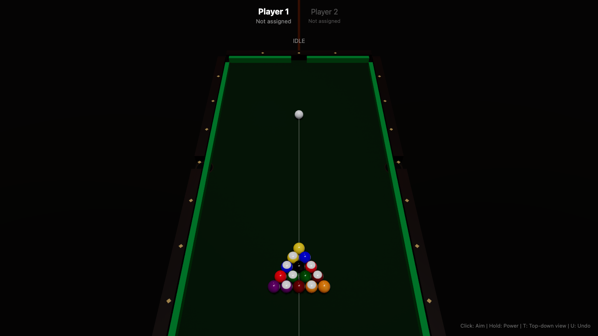

# 3D 8-Ball Pool Game

A browser-based 3D 8-ball pool game built with React, Three.js, and cannon-es physics. Generated entirely by **zcode** — an AI coding agent using a docs-first pipeline approach.



## Tech Stack

- **Vite + React + TypeScript** — project scaffold & type safety
- **Three.js** via `@react-three/fiber` + `@react-three/drei` — 3D rendering
- **cannon-es** via `@react-three/cannon` — physics simulation
- **Zustand** — game state management

## Features

- Realistic 3D pool table with procedural textures
- 16 balls (cue ball + 15 numbered) with accurate physics
- Full 8-ball rules engine (fouls, group assignment, win/loss conditions)
- Aiming system with mouse control
- Power meter for shot strength
- Ball-in-hand placement after fouls
- Camera controls (orbit + top-down view)
- Undo support (single step)
- Shadow mapping with soft shadows

## Getting Started

```bash
# Install dependencies
npm install

# Start dev server
npm run dev

# Build for production
npm run build
```

Open http://localhost:5173 in your browser.

## Controls

| Control | Action |
|---------|--------|
| Mouse move | Aim direction |
| Mouse hold | Charge power |
| Mouse release | Shoot |
| T | Toggle top-down view |
| U | Undo last shot |
| R | Reset game |

## Architecture

```
src/
├── components/     # React Three Fiber components (Scene, Table, Ball, CueStick...)
├── physics/        # cannon-es physics world + ball bodies + pocket detection
├── game-logic/     # 8-ball rules engine + table bounds validation
├── store/          # Zustand stores (gameStore + aimStore)
├── hooks/          # Custom hooks (useAim, usePower, useSettleDetector, useShotSequence)
├── constants/      # Table dimensions, physics params, ball colors & rack positions
├── types/          # TypeScript type definitions
└── utils/          # Vector math + procedural texture generation
```

## Game State Machine

```
IDLE → AIMING → POWER → SIMULATING → EVALUATING → IDLE | GAME_OVER
```

## Generated by zcode

This project was created as a demonstration of **zcode's** docs-first pipeline:

1. **Pass 1**: Write comprehensive docs (PRD, tech spec, task breakdown, validation, review checklist)
2. **Pass 2**: Execute each task via `zcode run` — the AI agent reads docs, plans, writes code, and verifies

See `docs/` for the full documentation suite.
